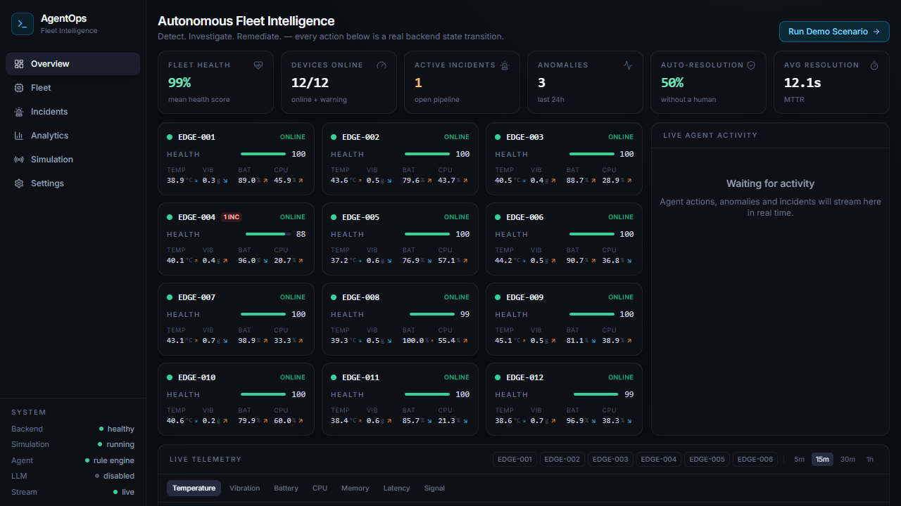
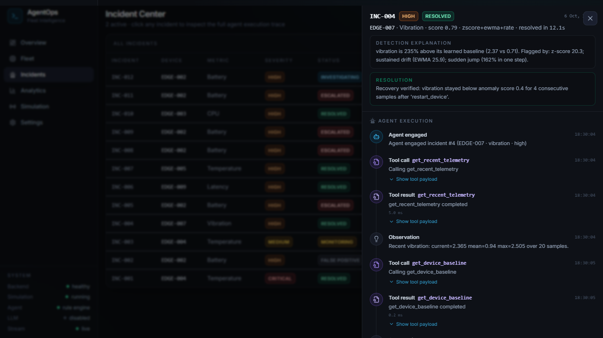
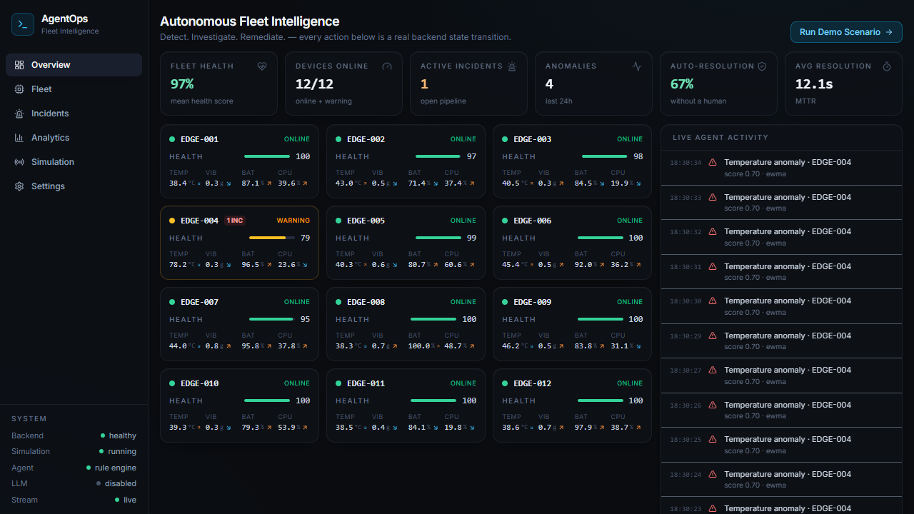
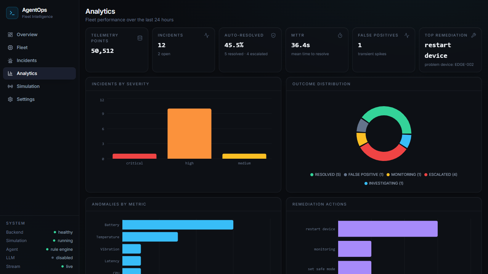
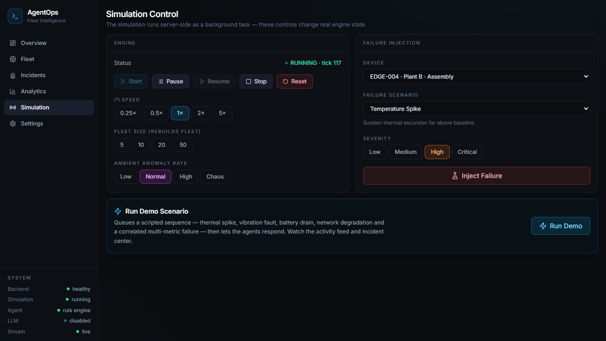
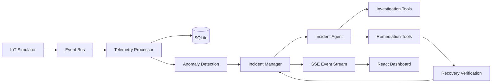

# AgentOps 2.0 — Autonomous IoT Fleet Intelligence

> A simulated IoT fleet produces telemetry. A hybrid anomaly-detection engine finds abnormal
> behavior. An **autonomous incident agent** investigates, gathers context, decides, executes
> remediation tools, **verifies recovery against the learned baseline**, and closes the incident —
> with every step persisted and streamed live to a dark observability dashboard.

No LLM/API key required — the default agent is a deterministic, fully reproducible rule engine.
LLM mode (Anthropic) is an optional drop-in with strict tool allowlisting and automatic fallback.

---

##AGENTOPS - commercial

https://github.com/user-attachments/assets/8234672c-cb25-444e-b3c5-2c0148eda374

##SETUP

```bash
docker compose up --build        # or see Local Setup below
# open http://localhost:8000
```

1. Sign in on the landing page (default dev credentials: **admin / agentops** — change them
   in Settings → Change Password; override via `ADMIN_USERNAME` / `ADMIN_PASSWORD`).
2. The dashboard opens on a live fleet — telemetry is already moving.
3. Click **Run Demo Scenario** (or go to `/simulation` and inject a failure manually).
4. Watch the loop unfold in real time:

```
telemetry → anomaly → incident → agent investigation → tool calls
          → decision → remediation → recovery verification → resolved
```

Every visible event is a real backend state transition — nothing is animated for show.

## Screenshots

| Live dashboard | Incident agent timeline |
|---|---|
|  |  |

| Failure in progress | Analytics | Simulation control |
|---|---|---|
|  |  |  |

---

## Features

- **Live fleet grid** — 12 simulated edge devices with per-device baselines, diurnal drift and noise; cards pulse on each telemetry tick.
- **Hybrid anomaly detection** — robust rolling z-score (median/MAD), fast/slow EWMA divergence, gated rate-of-change, and per-device **Isolation Forests** fused into one explainable score.
- **False-positive suppression** — persistence windows, hysteresis, cooldowns, duplicate grouping, correlated multi-metric incident merging.
- **Autonomous agent** — OBSERVE → INVESTIGATE → DECIDE → ACT → VERIFY → RESOLVE state machine with a strict tool registry and risk classes.
- **Recovery verification** — incidents are *not* closed on action; the agent re-checks the metric against the (gate-protected, uncontaminated) learned baseline for N consecutive samples, retries once, then escalates.
- **Failure injection** — 12 named scenarios (thermal spike/drift, vibration, battery drain, CPU saturation, memory leak, latency, weak signal, stuck sensor, correlated failure, offline, recovery-after-restart).
- **Real-time UX** — one Server-Sent-Events stream powers device cards, charts, the activity feed, incident updates and toasts; automatic reconnect.
- **Analytics** — MTTR, auto-resolution rate, severity/outcome/metric/action distributions, device health distribution.
- **Optional LLM planner** — validated structured output, falls back to rules on any failure.
- **One-container deploy** — multi-stage Docker build serves API + frontend from a single process.
- **Operator sign-in** — PBKDF2-hashed credentials, revocable DB sessions in httpOnly cookies,
  landing page gate, change-password flow. `/api/health` stays public for platform checks.
- **Feature flags** — experimental work ships dark behind `FEATURE_FLAGS`, keeping `main` always deployable.

## Architecture



Everything runs **in-process**: no Kafka, Redis, Celery, or external services. The simulation
engine is a background task; the whole pipeline is a deterministic, tick-driven state machine that
tests advance synchronously.

## System flow

| Stage | What actually happens |
|---|---|
| Telemetry | 12 devices × 7 metrics per tick, batch-inserted into SQLite, published to the bus |
| Detection | Per (device, metric): z-score + EWMA + rate; per device: Isolation Forest over the 7-metric vector; weighted fusion |
| Suppression | 3-sample persistence, 60 s cooldown, active-incident grouping (also across correlated metrics) |
| Incident | Created with severity, fused score, detector list and a plain-language explanation |
| Investigation | Agent calls `get_recent_telemetry`, `get_device_baseline`, `get_device_history`, `get_related_metrics` — one step per tick, all recorded |
| Decision | Ordered deterministic rules (or validated LLM output); produces a safe operational explanation |
| Remediation | Risk-classed, idempotent tool execution (`restart_device`, `set_safe_mode`, `reset_sensor`, …) |
| Verification | N consecutive baseline-referenced healthy samples required → else retry chain → else escalate |
| Resolution | Status transition + notes + full `AgentEvent` timeline persisted and streamed |

## Detection engine

```
anomaly_score = w_z·zscore + w_ewma·drift + w_roc·rate + w_if·iforest     (weights 0.30/0.20/0.15/0.35)
```

- **Robust z-score** uses median/MAD so an ongoing fault can't contaminate its own baseline.
- **EWMA fast/slow divergence** catches slow ramps (memory leaks, thermal creep) that rolling
  windows absorb; residual variance is frozen during anomalies so drift can't mask itself.
- **Rate-of-change** is noise-floor gated (needs ≥4σ absolute move) and can't satisfy persistence alone.
- **Isolation Forest** abstains until trained (weights renormalize), then scores unusual
  *combinations* — it's a first-class voter, with a validated manual scoring path ~60× faster
  than sklearn's joblib-dispatched `decision_function`.
- **Dominant-detector override**: any structural detector at ≥0.9 sub-confidence may alarm alone
  (that's how EWMA-only leaks get caught).
- Severity bands: `0.35 low · 0.55 medium · 0.70 high · 0.85 critical` (configurable).

## The agent

Tools are registered with **risk classes** and JSON input schemas:

| Class | Tools |
|---|---|
| LOW_RISK | `get_recent_telemetry`, `get_device_baseline`, `get_device_health`, `get_device_history`, `get_related_metrics`, `verify_recovery`, `close_incident` |
| MEDIUM_RISK | `reset_sensor`, `reduce_sampling_rate`, `set_safe_mode` |
| HIGH_RISK | `restart_device` |
| HUMAN_REQUIRED | `escalate_to_human` |

Deterministic decision rules (ordered, explainable): battery→escalate · offline→restart ·
stuck sensor→reset · temp+vibration→safe mode then restart · CPU saturation→safe mode ·
thermal/memory→restart · isolated latency/signal→monitor · transient→false positive.
Remediation is idempotent (30 s per-device window) and capped at 2 automated attempts before
escalation. The UI shows **decision explanations**, never hidden chain-of-thought.

## Tech stack

**Backend** — Python 3.12+, FastAPI, Pydantic v2, SQLAlchemy 2, SQLite, NumPy, scikit-learn,
Uvicorn, pytest · **Frontend** — React 18, TypeScript, Vite, Tailwind CSS, Recharts,
Framer Motion, Lucide, react-router · **Infra** — Docker (multi-stage), docker-compose, Render/Railway-ready.

## Project structure

```
agentops-2/
├── backend/
│   ├── app/
│   │   ├── main.py                 # app factory, lifespan, static frontend, /api/health
│   │   ├── api/                    # routes: devices, telemetry, incidents, simulation, analytics, events(SSE)
│   │   ├── core/                   # config, event bus, logging, runtime orchestrator
│   │   ├── db/                     # engine, models, repository, pydantic schemas
│   │   ├── simulation/             # metric specs, device model, scenarios, engine
│   │   ├── detection/              # zscore, ewma, rate, isolation forest, fusion, detector
│   │   ├── incidents/              # lifecycle state machine, manager (dedup/grouping)
│   │   ├── agent/                  # state, rules, agent loop, llm, prompts
│   │   ├── tools/                  # registry + investigation/remediation tools
│   │   └── services/               # fleet, telemetry, incident, analytics
│   ├── tests/                      # 56 tests incl. deterministic end-to-end
│   └── requirements.txt
├── frontend/
│   └── src/{components,pages,hooks,lib,types}
├── data/                           # SQLite lives here (git-ignored)
├── Dockerfile                      # all-in-one: frontend build → backend → runtime
├── docker-compose.yml
├── render.yaml
└── .env.example
```

## Local setup

**Backend** (Python 3.12+):

```bash
# From the repo root — handles venv creation + correct module path:
./start-backend.ps1          # Windows        → http://localhost:8000
./start-backend.sh           # macOS/Linux    → http://localhost:8000

# Or manually — NOTE: uvicorn must run from backend/ (that's where the "app" package lives):
cd backend
python -m venv .venv && .venv/Scripts/python -m pip install -r requirements.txt   # Windows
# python -m venv .venv && .venv/bin/pip install -r requirements.txt               # macOS/Linux
.venv/Scripts/python -m uvicorn app.main:app --reload
```

> **Common pitfall:** running `uvicorn app.main:app` from the repo root fails with
> `ModuleNotFoundError: No module named 'app'` — the package is inside `backend/`.
> Use the launcher scripts or `--app-dir backend`.

**Frontend** (Node 20+):

```bash
cd frontend
npm install
npm run dev        # http://localhost:5173 (proxies /api → :8000)
```

## Docker

```bash
docker compose up --build          # http://localhost:8000 (API + UI, one container)
# or without compose:
docker build -t agentops .
docker run -p 8000:8000 agentops
```

## Tests

```bash
cd backend
.venv/Scripts/python -m pytest tests -q
# 56 passed — simulator, detectors (incl. Isolation Forest fast-path parity),
# agent rules/chains/idempotency/LLM-fallback, API, SSE (live server),
# and a deterministic end-to-end autonomous-loop test
```

## Environment variables

See [.env.example](.env.example). Highlights: `DATABASE_URL` (SQLite default, PostgreSQL-ready),
`SIMULATION_SPEED`, `ANOMALY_THRESHOLD`, `DEVICE_COUNT`, `RANDOM_SEED`, `ADMIN_USERNAME`,
`ADMIN_PASSWORD`, `SHOW_DEMO_CREDS`, `FEATURE_FLAGS`, `LLM_ENABLED` + `ANTHROPIC_API_KEY`
(optional), `PORT`.

## Deployment

Full guide: **[docs/DEPLOYMENT.md](docs/DEPLOYMENT.md)** — Render blueprint (`render.yaml`
included), Railway (Dockerfile auto-detected), or an instant public demo via Cloudflare
quick tunnel (`cloudflared tunnel --url http://localhost:8000`, no account needed).

**Production checklist:** set `APP_ENV=production`, strong `ADMIN_PASSWORD`,
`SHOW_DEMO_CREDS=false`. Free-tier filesystems are ephemeral — the SQLite demo DB resets
on redeploy; attach PostgreSQL via `DATABASE_URL` for persistence.

## Safe daily development (experiment without breaking production)

`main` is always deployable. Experiments ship dark behind **feature flags**, CI must be
green to merge, and rollback is minutes, not hours:

- **CI gate** — `.github/workflows/ci.yml`: backend tests + frontend build + Docker smoke on every PR.
- **Feature flags** — `FEATURE_FLAGS="predictive_health=true"`; flag OFF = feature doesn't exist (404 + hidden UI).
- **Rollback runbook** — **[docs/RELEASE_PROCESS.md](docs/RELEASE_PROCESS.md)**: flag off (<1 min),
  Render previous deploy (~2 min), `git revert` (permanent), tagged releases for known-good states.
- Contributing workflow: **[CONTRIBUTING.md](CONTRIBUTING.md)**.

## API surface (selected)

```
GET  /api/health                       GET  /api/events/stream (SSE)
GET  /api/devices                      GET  /api/devices/{id}/telemetry?metric=&minutes=
GET  /api/incidents                    GET  /api/incidents/{id}/timeline
GET  /api/analytics/overview           POST /api/simulation/start|stop|pause|resume|reset
POST /api/simulation/inject            POST /api/simulation/demo
POST /api/simulation/speed             POST /api/devices/{id}/actions/restart
```

## Known limitations

- SQLite + in-process bus: single-node only; the SSE bus history is in-memory (300 events).
- Render free tier restarts wipe the demo database (documented above).
- Isolation Forest retrains periodically in-process (~0.3 s spikes, staggered across devices).
- The agent's world is the simulated fleet — tool outputs reflect simulation state, by design.

## Future improvements

- PostgreSQL backend + horizontal SSE fan-out (Redis pub/sub) for multi-node
- Alert routing (webhooks/email) on escalation; human-in-the-loop approval queue for HIGH_RISK tools
- Seasonal (hour-of-day) baselines and per-device adaptive thresholds
- Trace export (OpenTelemetry) and a `DeviceAction` approval API
- Multi-incident correlation across devices (site-level root cause)

## Interview talking points

- Hybrid anomaly fusion with calibrated abstention (IF renormalizes out when untrained)
- Contamination-aware detectors: robust statistics + gated EWMA + baseline-referenced recovery
- Explicit agent state machine (testable, replayable) vs. opaque LLM loops — with optional validated LLM planner
- Safety: tool allowlists, risk classes, idempotency, bounded retries, human escalation
- Deterministic tick-driven architecture: production async pacing, tests run synchronously
- Performance engineering: custom Isolation Forest scoring path (~60× faster), single-session fleet sync, batched writes
